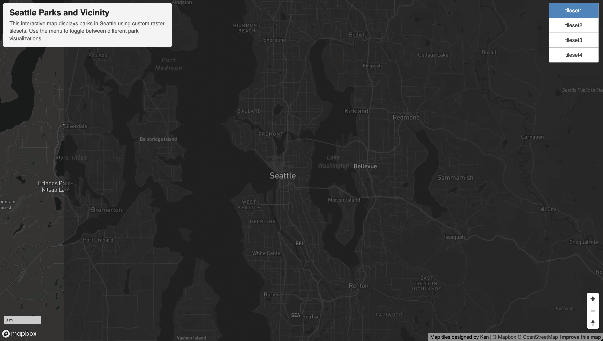
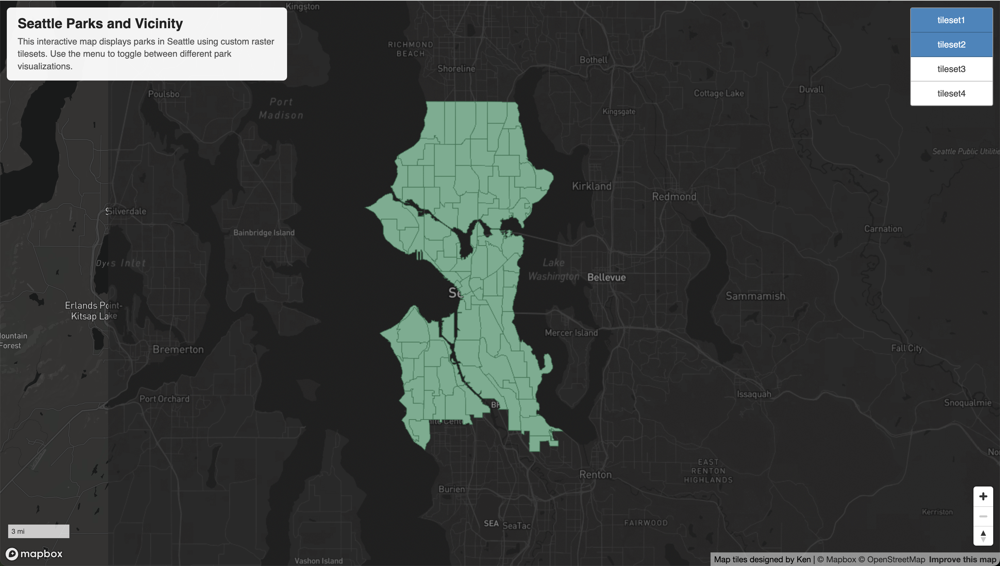
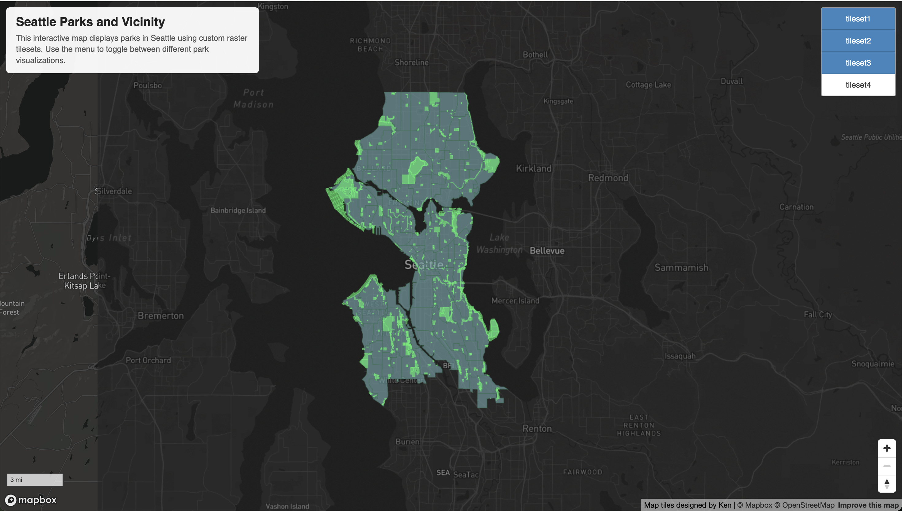
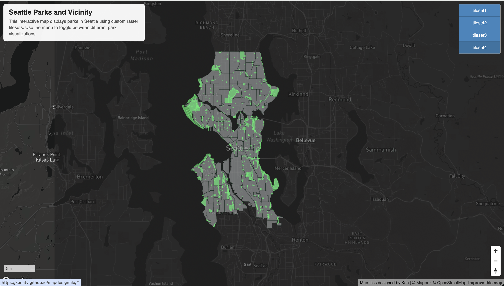

# Seattle Parks and Vicinity - Raster Tile Map

## Overview
This project is an interactive map that shows the process of gathering data, and creating a map in regards to parks in the Seattle area. Using custom raster tileset rendered using mapbox and QGIS. This map allows the user to go over 4 different maps displaying 4 different creation stages of this project. From base map to the finished product with parks and cities in the areas indicated. 

---

## Map URL
The URL that made this project possible is listed here

👉 *[tileset1](https://api.mapbox.com/styles/v1/kenatv/cml8q560p000r01szcw7k28p7.html?title=view&access_token=pk.eyJ1Ijoia2VuYXR2IiwiYSI6ImNtaGF4b2YwOTA3MnkycW9hbHMzY3R0YjEifQ.Pnh4mKoZc4eEtnDHXxD7Dg&zoomwheel=true&fresh=true#11.2/47.61/-122.33)*

👉 *[tileset2](https://api.mapbox.com/styles/v1/kenatv/cml8qgddn002b01sggst51lqp.html?title=view&access_token=pk.eyJ1Ijoia2VuYXR2IiwiYSI6ImNtaGF4b2YwOTA3MnkycW9hbHMzY3R0YjEifQ.Pnh4mKoZc4eEtnDHXxD7Dg&zoomwheel=true&fresh=true#11.2/47.61/-122.33)*

👉 *[tileset3](https://api.mapbox.com/styles/v1/kenatv/cml8riikm000t01szbuwx4gzf.html?title=view&access_token=pk.eyJ1Ijoia2VuYXR2IiwiYSI6ImNtaGF4b2YwOTA3MnkycW9hbHMzY3R0YjEifQ.Pnh4mKoZc4eEtnDHXxD7Dg&zoomwheel=true&fresh=true#11.2/47.61/-122.33)*

👉 *[tileset4](https://api.mapbox.com/styles/v1/kenatv/cml8rs93a002z01sscnn9a17h.html?title=view&access_token=pk.eyJ1Ijoia2VuYXR2IiwiYSI6ImNtaGF4b2YwOTA3MnkycW9hbHMzY3R0YjEifQ.Pnh4mKoZc4eEtnDHXxD7Dg&zoomwheel=true&fresh=true#11.2/47.61/-122.33)*

---

## Maps

### Tile 1

### Tile 2

### Tile 3

### Tile 4

---

## Geographic Area
The grographic area was chosen to be Seattle, this is because Washington is considered to be a green state where there is a lot of nature and forest. However, the city vibe in Seattle is generally considered to be grey and grim. Which is why in this finished project (tile4), I've decided to use grey for the city area and green representing the park areas in Seattle. 

---

## Zoom Levels
I've decided to allow the zoom level of 10 to 14 to display the necessary amount of information needed. The default zoom level is set to 11 as I believe it shows the entirety of Seattle. The user has the option to zoom via their mouse or the control option on the bottom right to zoom in to see the area. 

---

## Description of the Tile Set
- Tile 1 represents the base map of this project, it shows us what the theme is gonna be. As I've said before I believe that Seattle is a sad grey and rainy city. So I decided to use the darker tone for this base map. This will then be used for the future tiles as well. 

- Tile 2 shows us the dataset that I have gathered. It shows the cities in Seattle, however, the data hasn't been processed yet so there are no park shown in the map. This is a good basic layout for this map as it can then be used in the future to display other information the we wanted. The color for this was first thought to be green, however, it will be changed in the future to show contrast. 

- Tile 3 is a combined version of both the basemap and the data I've gathered. This time the park information has been added and displayed as green to show the green areas. This is a great decision on my part as it gives us a better idea of what our main target truly is.

- Tile 4 is the final tile displaying the complete product. It has everything similar to tile 3, however, this time I've changed the city area to be light grey to display the mood I wish to set on this map as well as the green that have been shown. The text aren't displayed that well because of the layers, which needs to be fixed if I have more time. 

---

## AI use disclaimer

AI have been used to help debug with the QGIS problem I had. I didn't know that I had to use the classic version of mapbox for the QGIS to work. 